Si vous me suivez sur [Twitter](https://twitter.com/Narno) vous savez déjà que j’ai enfin pu m’offrir un super joujou / utilitaire : le magnifique [Bullitt](/tags/bullitt) Bluebird de [Larry vs Harry](https://www.larryvsharry.com/) !

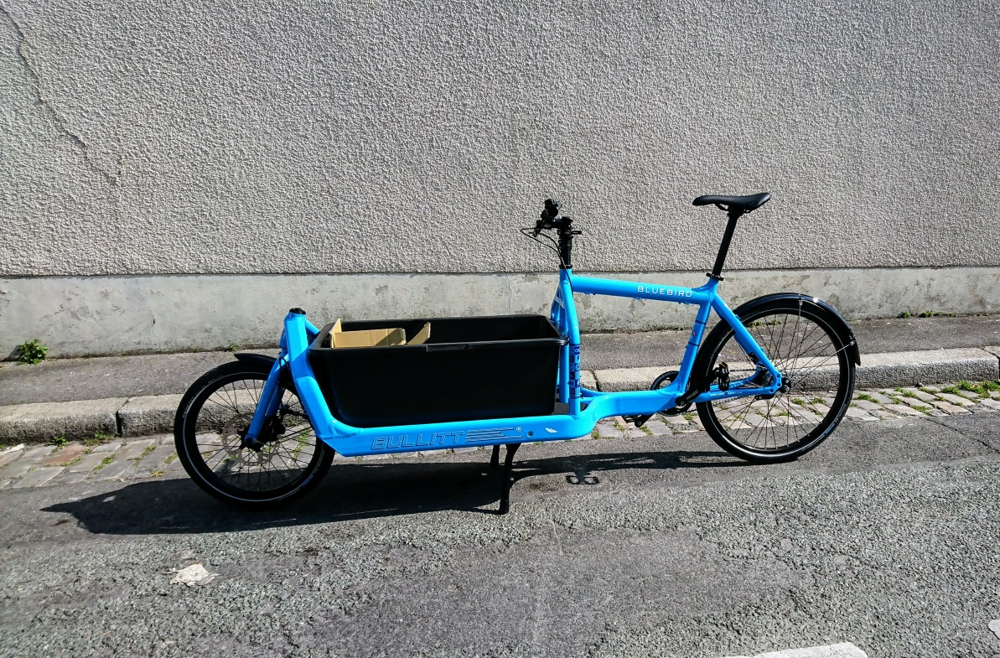{width="800"}

<!-- break -->

## Alors, y’a quoi dans le carton ?

Je me suis dit que pour les acquéreurs potentiels qui, comme moi à l’époque, appréhendent de savoir comment arrive un vélo cargo de plus de 2,40 mètres et surtout que contient le carton, ça pourrait être sympa de partager mon expérience.

Ainsi, voici quelques photos que j’ai réalisé à la réception de mon Bullitt.

### Le carton

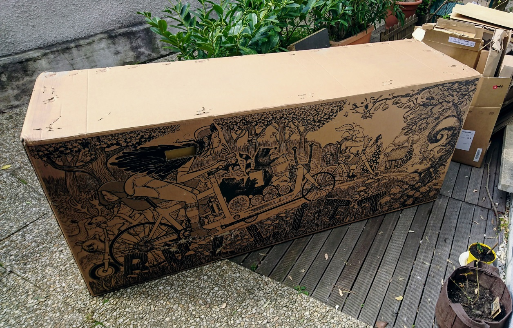{width="800"}

Le carton en lui même, arrivé sur une palette, livré par transporteur, est superbement illustré et amplifie le côté « cadeau de Noël avant l'heure » ! 🎅

### Ouverture

Après avoir enlevé le carton contenant le HCB ([Honeycomb Board](http://shop.larryvsharry.com/shop/accessories/honeycomb-board.html)), voici comment se présente l’agencement du cadre, des différentes pièces et autres accessoires :

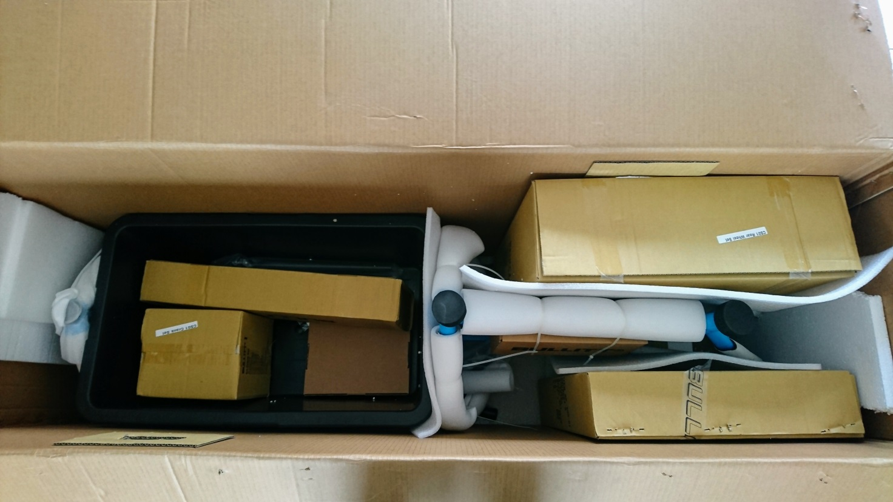{width="800"}

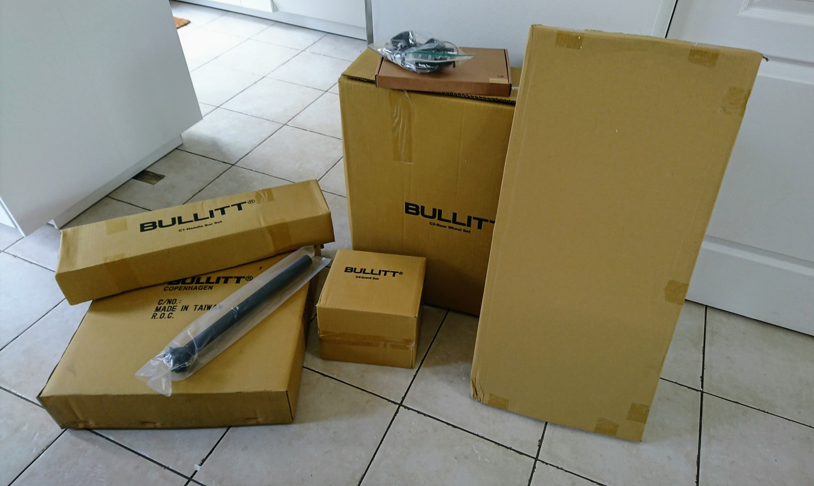{width="800"}

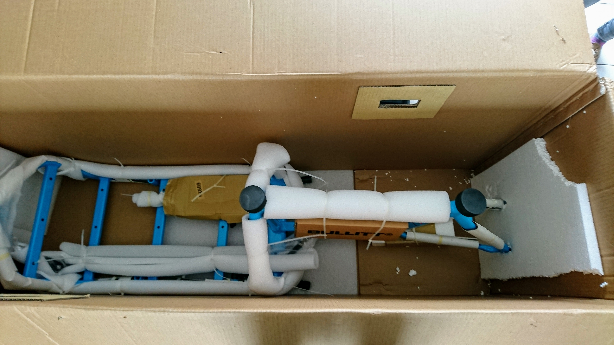{width="800"}

### Le cadre

Vous noterez que, mis à part la béquille qui est déjà fixée, le cadre est entièrement nu :

"){width="800"}

Il est très bien protégé, sauf le triangle arrière : pas de mousse de protection et en contact direct avec la paroi du carton.

En effet, comme on le voit sur la dernière photo de la section précédente, le bloc de polystyrène n’est pas suffisamment résistant, à été transpercé, exposant le cadre…

### Les roues

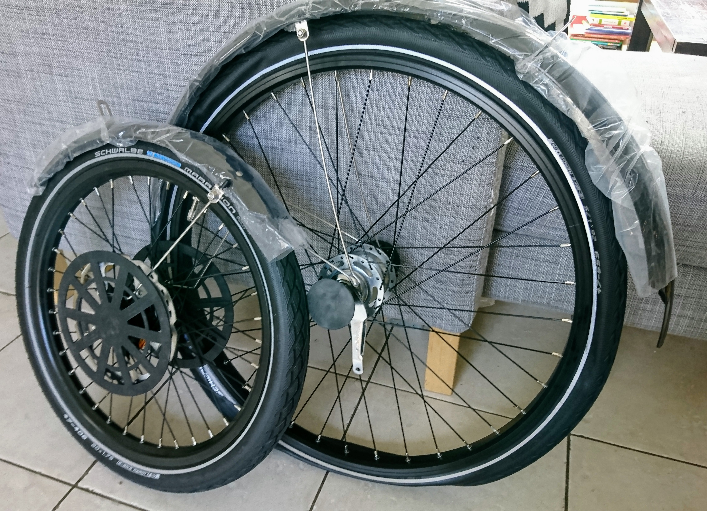{width="800"}

Le pneu (et la chambre à air donc) est déjà monté sur chaque roue : il ne reste plus qu’à gonfler !

Notez que les gardes-boue sont également pré-assemblés, et que la visserie est scotchée à l‘intérieur.

### Les supports de fixation

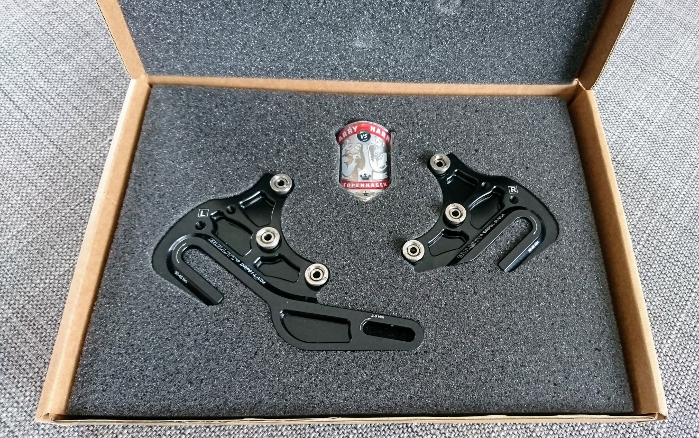{width="800"}

Au delà de l’écusson qui en jette pas mal, ce qui est important ici c’est le principe de ces 2 pièces permettant la fixation de la roue arrière : fixées sur le triangle, changeables selon la transmission.

Par exemple dans mon cas j’ai opté pour un [Nexus 7](https://si.shimano.com/pdfs/dm/DM-SG0003-05-FRE.pdf) à rétropédalage, donc pas de dérailleur mais une patte de fixation pour le mécanisme de freinage.

### Pédalier, boîtier et manivelles

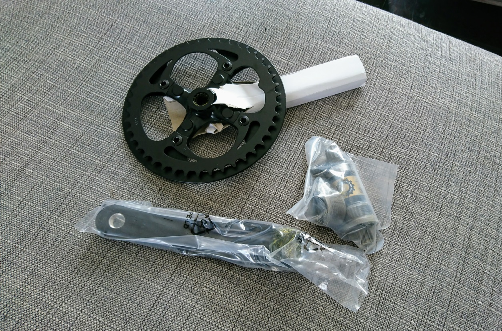{width="800"}

### Guidon, potence et câblage

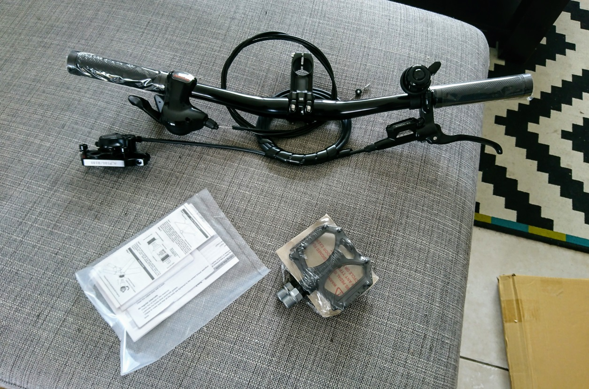{width="800"}

Alors là, c’est vraiment du caviar pour le montage :

1. Le système de frein (hydraulique) est déjà prêt : il ne reste plus qu’à passer le câble le long du cadre et à fixer l’étrier sur la fourche ! 👌
2. Idem pour le câble du Nexus qui est déjà de la bonne longueur.

### Direction et roulements

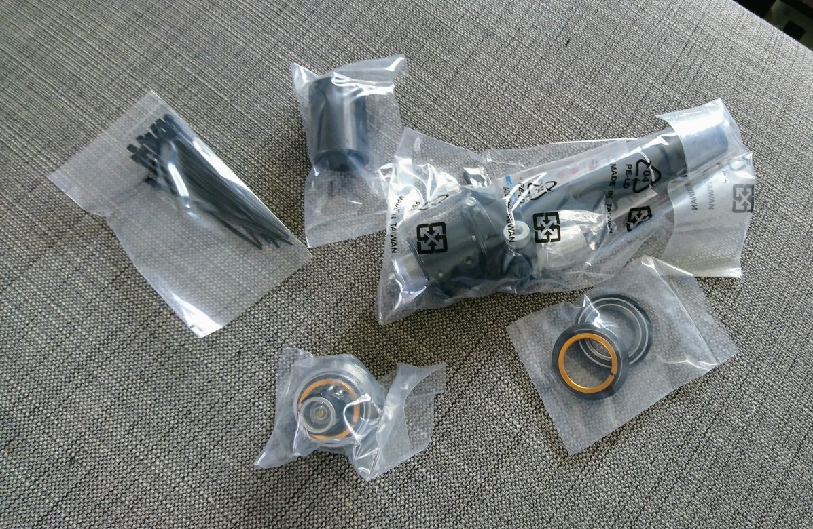{width="800"}

Entretoises, roulements et le fameux [Easyup Stemlifter](http://shop.larryvsharry.com/shop/handlebar-stems-grips/easyup-stemlifter.html).

Pour être complète cette photo aurait du contenir le tube (d’environ 70 cm descendant verticalement depuis le guidon en lieu et place de la fourche sur un vélo traditionnel) et la [barre de direction](http://shop.larryvsharry.com/shop/brakes-and-spare-parts/steering-arm-complete-w-balljoint.html) reliée à la fourche.

### Éclairages

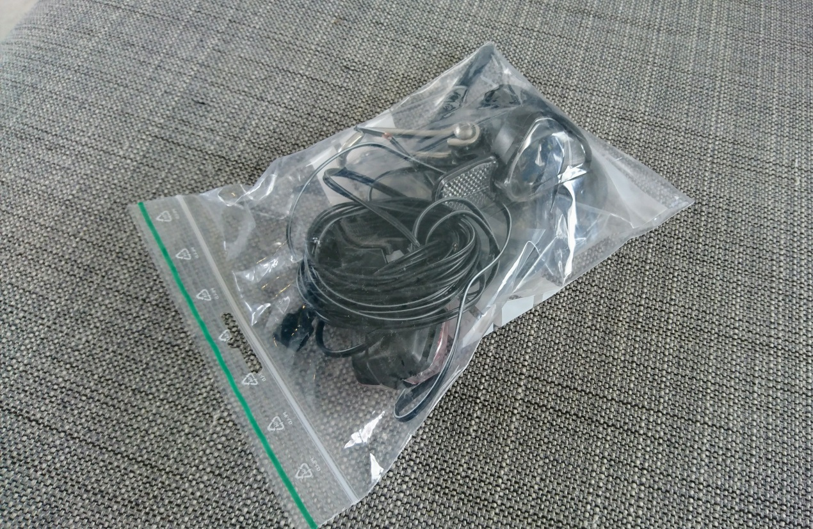{width="800"}

Si vous avez pris l’option (et vous devriez) : éclairage par dynamo (dans la roue avant) [Busch & Müller Lumotec IQ Avy Plus N](https://www.bumm.de/en/products/dynamo-scheinwerfer/produkt/162rtsndi.html) et [Secula](https://www.bumm.de/en/products/dynamo-rucklichter/produkt/331-2ask.html?).

---

Et voilà !

J’essaierai de détailler un peu plus le montage dans un autre billet.

Retenez que ça reste très facile, y compris pour un néophyte, d’autant plus une fois qu’on a mis la main sur le [manuel officiel](/files/Bullitt-manual-2018-NL.pdf) après 1 heure de montage ! 😄
