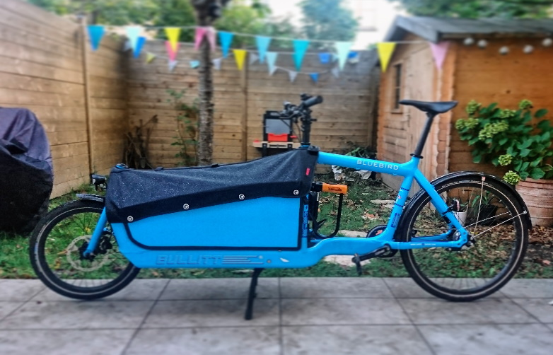

Ces dernières semaines j’ai régulièrement été sollicité, soit via [Twitter](https://twitter.com/Narno), soit dans la rue, à propos de mon vélo cargo [Bullitt](/tags/bullitt).

{width=800}

Aussi je me suis dit que ça pourrait être intéressant de partager mon expérience, après plus d’un an d’utilisation de mon [Bullitt](/tags/bullitt) au quotidien.

En effet, depuis avril 2019 je roule quasiment exclusivement avec mon vélo cargo, que ce soit pour le vélotaf, les courses, déposer mon fils à l’école ou encore pour me balader / défouler.
<!-- break -->

## FAQ

Pour faire simple, ci-dessous les réponses aux questions qu’on me pose le plus souvent.

> **Il est électrique ? 🔌**

Ce n’est pas un VAE. J’ai retenu la version sans assistance pour 2 raisons :

1. le coût : allant quasiment du simple au double
2. la liberté "technique" : je ne souhaitais pas être contraint ni par un moteur (poids et dépendance mécanique), ni par l’obligation d’avoir une batterie chargée pour la moindre sortie

> **C’est lourd ? Ça peut transporter quel poids ? ⚖️**

Le Bullitt est connu pour être léger (cadre en aluminium) au regard sa longueur (2,40 mètres) et de sa capacité de charge (100 kg).

Dans le cas de ma configuration de base (7 vitesses moyeu) le poids total tout équipé pour rouler est de [22 kg](https://www.larryvsharry.com/en/bullitt).

Par contre l’aiguille de la balance monte vite quand on commence à ajouter des équipements. Dans mon cas, en ajoutant la planche, les panneaux latéraux, la housse, le siège pliant et les antivols, je pense dépasser les 30 kg !

> **Ce n’est pas trop difficile sans moteur ? ⚙️**

Pour un usage urbain, peu vallonné, ça passe très bien sans assistance. Y compris avec "seulement" les 7 vitesses du Nexus.

Néanmoins, au-delà de 50 kg de charge, mieux vaut avoir les mollets entraînés !

> **Ça coûte combien ? 💵**

Mon modèle m’a coûté environ 2800 euros, frais de port compris (livré par un transporteur depuis Copenhague).

Pour des raisons de budget j’ai opté pour la transmission la moins coûteuse, à savoir le [Shimano Nexus 7](https://en.m.wikipedia.org/wiki/Shimano_Nexus) à frein par rétropédalage.

Avec le recul, si j’avais su j’aurais opté pour le [Shimano Alfine 8](https://en.m.wikipedia.org/wiki/Shimano_Alfine) afin de profiter d’un étagement plus large et surtout d’un frein à disque à l’arrière.

En effet, même si la combinaison du frein à disque à l’avant et du rétropédalage à l’arrière reste efficace et suffisant, un double frein à disque reste nettement plus confortable, surtout sur route mouillée et/ou très chargé.

> **On peut transporter des enfants ? 👪**

Je transporte mon fils quasiment quotidiennement, en sécurité grâce au [siège officiel](https://www.larryvsharry.com/en/foldable-seat) équipé d’une ceinture.

Ce siège comporte d’ailleurs 2 ceintures, néanmoins, sans la [canopée](https://www.larryvsharry.com/en/canopy) il sera difficile d’asseoir 2 enfants côte à côte entre les _side panels_.

## Notes & remarques

- Je n’ai effectué aucun entretien spécifique depuis l’achat, si ce n’est vérifier certains serrages, remplacer les plaquettes de frein et nettoyer la chaîne
- Les pneus [Schwalbe Marathon](https://www.schwalbe.com/fr/) (équipés d’origine) sont effectivement increvables et suffisamment confortables par temps sec, mais la tenue de route est nettement moins bonne sur route mouillée
- *à compléter ?*

## Conclusion

Quoi qu’il en soit j’adore circuler avec mon Bullitt, que ce soit pour aller travailler, déposer mon fils à l’école, faire les courses ou juste pour le plaisir de rouler ! 😊

*[VAE]: Vélo à Assistance Électrique
