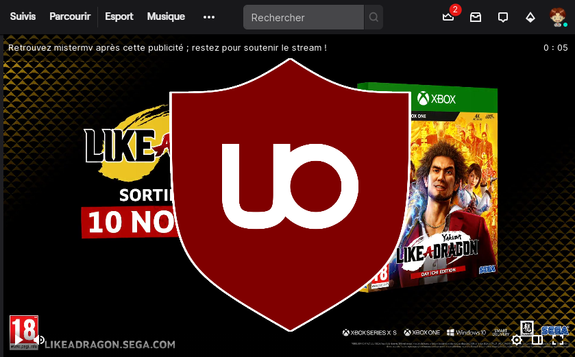

> **Le script ne fonctionne plus !**
> Il a été modifié le 12/11/2020, a fonctionné de nouveau pendant quelques jours, puis plus tout…

Si comme moi vous avez récemment découvert les **publicités au chargement d’un stream sur Twitch**, c’est que jusqu’à maintenant vous utilisiez [uBlock Origin](https://github.com/gorhill/uBlock) et qu’il les bloquait. Mais depuis quelques jours Twitch a modifié la manière dont les publicités en « pre-roll » sont affichées et passent le filtrage par défaut de uBlock Origin.

{width=800}

Pour les bloquer à nouveau il suffit d’appliquer un script complémentaire :
<!-- break -->

1. Accéder aux **options de uBlock Origin**
2. Cocher la case « **Activer les fonctionnalités avancées** »
3. Puis cliquer sur « **Paramètres avancés** » (icône d’engrenages en regard à droite)
4. Modifier la valeur de `userResourcesLocation` (dernière ligne) pour `https://gist.githubusercontent.com/Narno/64d7f70c22f07a9eee490a39766dc11b/raw/twitch.js` 
5. Ensuite, dans l’onglet « Liste de filtres » cliquer sur « **Vider tous les caches** » puis « **Mettre à jour maintenant** »

Et voilà ! 🐱‍💻
