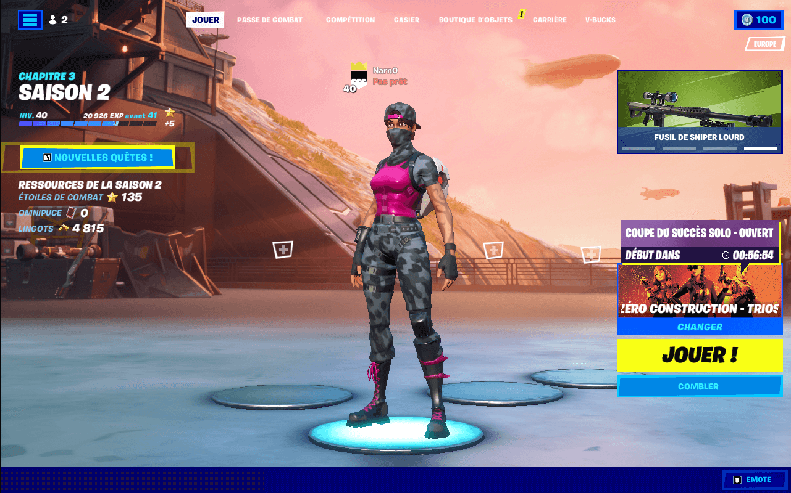

<!-- break -->
[toc]

## Papa, on peut installer Fortnite ?

Il y a quelques semaines mon fils m’a parlé de Fortnite, jeu vidéo très populaire « chez les jeunes » depuis quelques années (ma nièce y jouait régulièrement pendant le 1er confinement, pour papoter avec ses copains du collège tout en passant un bon moment ensemble).

Mon fils lui n’est pas encore au collègue, néanmoins quelques uns de ses copains (surtout les garçons) y jouent souvent, et il a noté scrupuleusement leurs pseudos sur un bout de papier pour les ajouter en amis dans le jeu.

Par crainte qu’il ne rate un truc à partager avec ses copains (je pense que les expériences sociales sont très importante à cette âge là, qu’elles forgent les amitiés) j’ai accepté qu’on installe le jeu sur la Switch[^switch] « pour essayer ».

## Achetez, c’est gratuit !

.")

À peine le jeu installé et lancé pour la 1ère fois, ce qui saute au yeux (à la figure ?) ceux sont tous ces messages et autres boites de dialogue qui poussent à consommer : des skins exclusives, des danses, des emotes, etc. Bref une tonnes d’accessoires cosmétiques qui se renouvelles chaque semaine..

Ca n’aura pas été simple pour naviguer avec le fiston sur cette interface digne d’un étalage de foire à tout mais il a rapidement pu lancer une partie.

> J’arrête la rédaction de ce billet ici, que je reprendrai peut être un jour…

## 2 semaines plus tard…

...j’ai un perso level 40 😆

[^switch]: La  Switch est la console de jeu de Nintendo.
