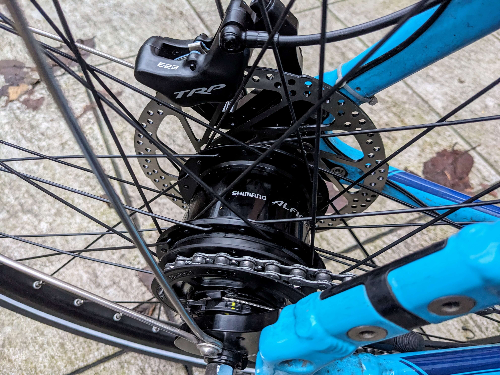
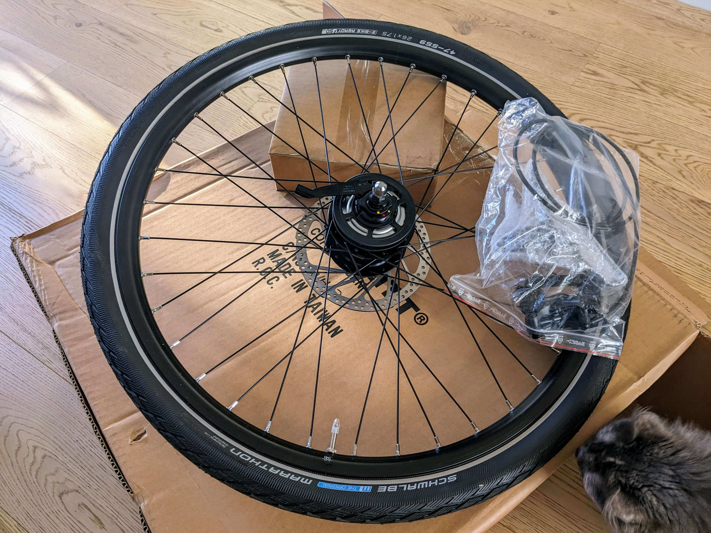
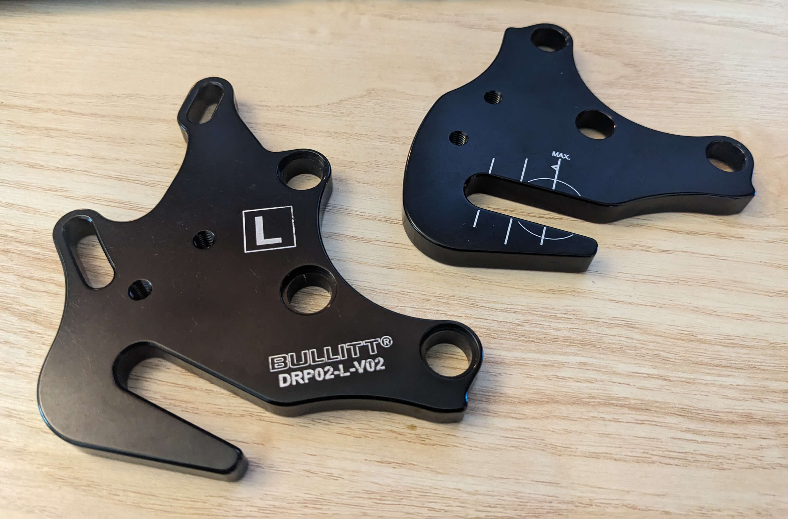
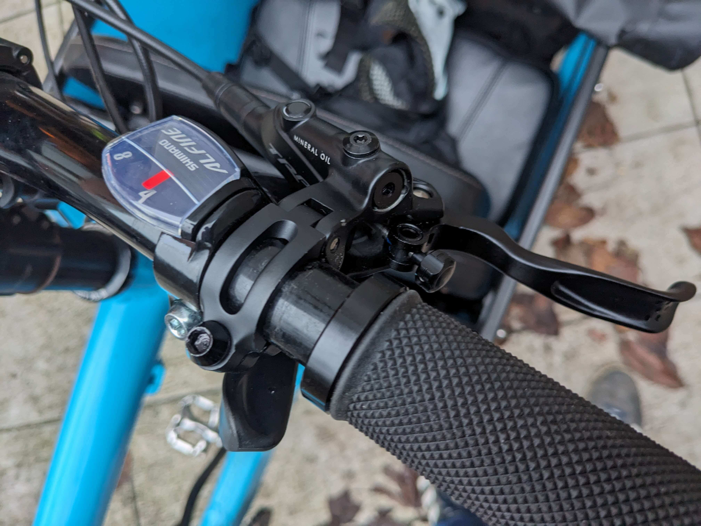
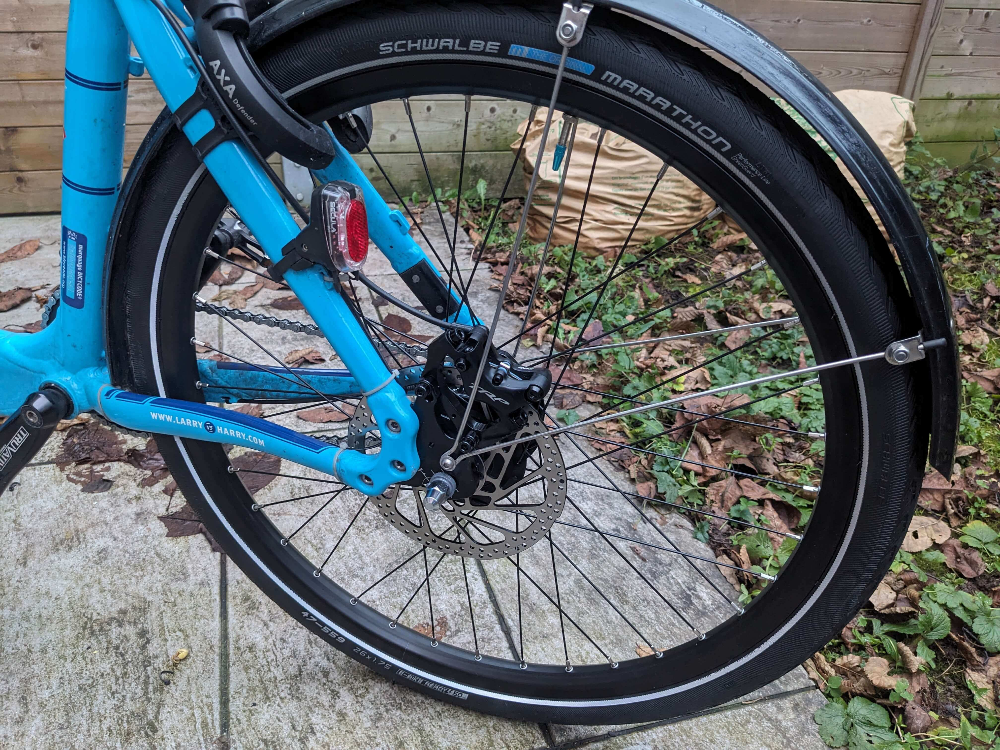
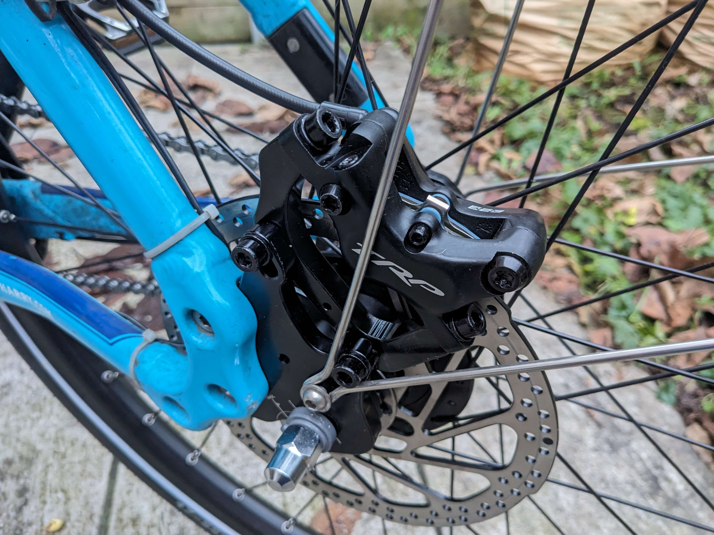

Je roule sur un vélo cargo [Bullitt](/tags/bullitt) depuis quelques années maintenant et j’avais rédigé un premier [retour d’expérience en 2020](page:blog/velo-cargo-bullitt-partage-experience), dans lequel j’indiquais (entre autres) que je regrettais de ne pas avoir opté pour un moyeux à vitesses plus haut de gamme que le Shimano Nexus 7 (avec frein à rétropédalage), faute de budget.

Nous en sommes en 2025, et depuis janvier je me suis offert une nouvelle roue équipée d’un moyeu à vitesses [Shimano Alfine 8](https://bike.shimano.com/fr-FR/products/components/pdp.P-SG-S7001-8.html) et d’un frein à disque hydraulique [TRP Slate EVO](https://tektro.eu/fr/trp/featured_item/slate-evo/) 😀

{fetchpriority=high loading=eager}

<!--break-->

## Se procurer la roue, pré-montée, à quel coût ?

Je m’étais renseigné sur les options possibles afin d’assembler une nouvelle roue « sur mesure », équipée d’une jante résistante et pas trop lourde, le fameux moyeux à vitesse, le frein à disque hydraulique, etc. et ça n’était pas simple de trouver un vélociste proposant ce service.

J’avais aussi étudié la possibilité de le faire moi même, mais j’avoue avoir douté de ma capacité à faire le choix des pièces compatibles et à réaliser le rayonnage sans expérience…

C’est alors que j’ai découvert que [Larry vs Harry](https://larryvsharry.com), les créateurs du [Bullitt](/tags/bullitt), proposaient maintenant des [roues complètes](https://larryvsharry.com/collections/complete-wheels) directement à la vente en ligne. Excellente nouvelle !

Concernant le coût, cette approche est forcément plus onéreuse puisqu’au delà de la main d’œuvre il faut également s’acquitter des frais de port.

En toute transparence, le budget global est supérieur à 650 euros : 510 € pour la roue complète + 140 € de frein hydraulique.

## Montage

Pas grand chose à dire sur le montage tellement c’est simple, parce que :

1. Avec un moyeu à vitesses il n’y a, par définition, pas de dérailleur extérieur à régler (il suffit de tendre le câble selon l’indicateur unique)
2. Câble et gaine sont pré-découpés à la bonne longueur et déjà reliés au shifter (idem pour le levier de frein et sa durite)
3. Le cadre du Bullitt est équipé de supports afin de passer et fixer les gaines

### Points d’attention

#### Le remplacement du « Dropout kit »

Le seul « vrai » point d’attention est de ne pas oublier d’anticiper le remplacement des supports de fixation (*Dropout kit*) afin d’y fixer l’étrier du frein hydraulique.

D’ailleurs un grand merci à [Urban Cycle](https://www.urbancycle.fr/velo-cargo-bullitt/) de m’avoir trouvé et vendu (à prix coûtant) ces supports !

#### Positionnement de l’étrier de frein

Je me suis fait avoir lors des premiers mois à cause d’un mauvais alignement de l’étrier de frein par rapport au disque, positionné trop haut, impliquant une moindre efficacité et surtout une usure anormale des plaquettes.

## Conclusion et photos

Je suis très content de cet investissement : le fait d’avoir un freinage plus efficace, immédiatement (sans avoir à sur-anticiper chaque situation comme c’est le cas avec un frein à rétro-pédalage), est très confortable.

Et surtout, quand tu as goûté au moyeu à vitesses, difficile de revenir en arrière : réglage unique, peu d’entretien, moins fragile et possibilité de changer de vitesse à l’arrêt, ce qui est très pratique après un freinage d’urgence et qu’il faut repartir chargé.

Je m’y étais déjà habitué avec le Nexus 7, et c’est encore plus confortable avec l’Alfine 8.

### Photos

Ci-dessous quelques photos complémentaires :

