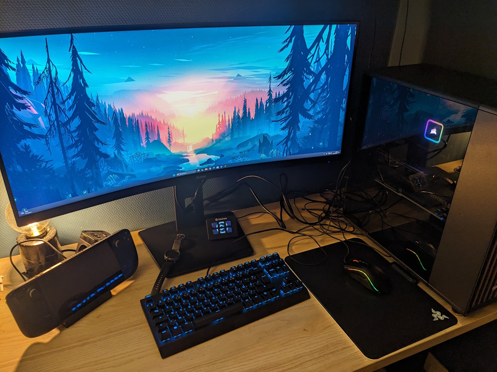

La configuration matérielle de mon PC de jeu.

| Composant       | Description |
| --------------- | ----------- |
| Boîtier         | [Fractal North TG noir](https://www.fractal-design.com/products/cases/north/north/charcoal-black/) |
| Alimentation    | [Corsair CX Series CX750](https://www.corsair.com/fr/fr/p/psu/cp-9020279-eu/cx-series-cx750-750-watt-80-plus-bronze-atx-power-supply-eu-cp-9020279-eu) |
| Carte Mère      | [Gigabyte B760 Aorus Elite AX DDR4](https://www.gigabyte.com/fr/Motherboard/B760-AORUS-ELITE-AX-DDR4-rev-1x#kf) |
| Processeur      | [Intel CoreTM i7-12700K](https://www.intel.fr/content/www/fr/fr/products/sku/134594/intel-core-i712700k-processor-25m-cache-up-to-5-00-ghz/specifications.html) |
| Ventirad        | [Corsair H100x RGB Elite](https://www.corsair.com/fr/fr/p/cpu-coolers/cw-9060065-ww/icue-h100x-rgb-elite-liquid-cpu-cooler) |
| Carte Graphique | [GeForce RTX 4070 Ti SUPER Trinity Black Edition 16 Go GDDR6X](https://www.zotac.com/fr/product/graphics_card/zotac-gaming-geforce-rtx-4070-ti-super-trinity-black-edition-16gb-gddr6x-0) |
| Mémoire         | [Corsair Vengeance RGB PRO 16 Go](https://www.corsair.com/fr/fr/p/memory/cmw16gx4m2z3600c18/vengeancea-rgb-pro-16gb-2-x-8gb-ddr4-dram-3600mhz-c18-amd-ryzen-memory-kit-a-black-cmw16gx4m2z3600c18) |
| SSD + HDD       | [Solidigm P41 Plus 512 Go](https://www.solidigm.com/products/client/plus-series/p41.html) + Seagate Barracuda SATA-III |
| Écran           | [iiyama Prolite XCB3494WQSN-B5 LED 34"](https://iiyama.com/fr_fr/produits/prolite-xcb3494wqsn-b5/) |
| Souris          | [Razer Mamba Wireless](https://www.razer.com/fr-fr/gaming-mice/razer-mamba-wireless) |
| Tapis           | [Razer Firefly](https://www.razer.com/fr-fr/gaming-mouse-mats/razer-firefly) |
| Clavier         | [Razer Cynosa Chroma](https://www.razer.com/fr-fr/gaming-keyboards-keypads/razer-cynosa-chroma) |
| Casque          | [Razer BlackShark V2 HyperSpeed](https://www.razer.com/fr-fr/gaming-headsets/razer-blackshark-v2-hyperspeed) |
| OS              | Windows 11 Famille |
