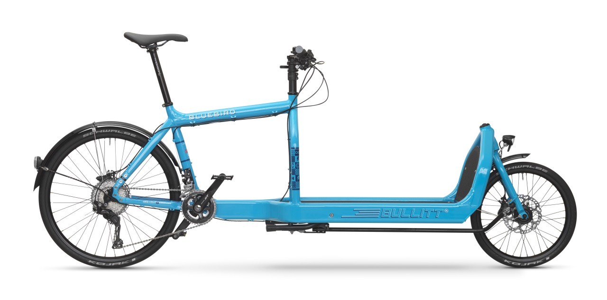
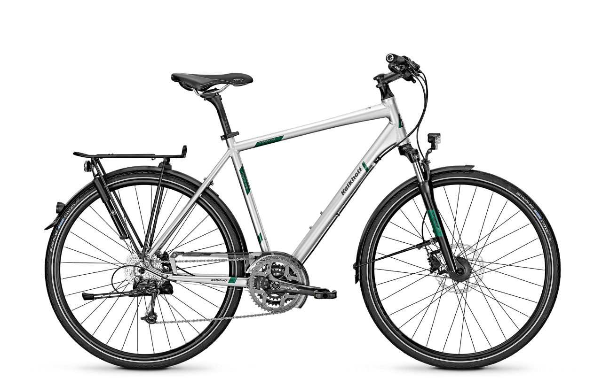

- [Bullitt Bluebird](#bullitt-bluebird)
- [Kalkhoff Voyager](#kalkhoff-voyager-dlx-27-g)

----

## Bullitt Bluebird

[{width=800}](https://larryvsharry.com/products/original-bullitt)

----

## Kalkhoff Voyager DLX 27-G

{width=800}

| Composant | Description |
| --------- | ----------- |
| Cadre | Trekking 1.0 alliage |
| Fourche | Suntour NEX, alliage, réglable |
| Freins | [Shimano M396](https://bike.shimano.com/fr-FR/product/component/acera-t3000/BL-M396.html) (à disque hydraulique) |
| Cassette | Shimano Alivio |
| Dérailleur arrière | Shimano Deore |
| Manettes de dérailleur | Shimano Deore |
| Pédalier | Shimano Deore |
| Dentition | Avant : 48/36/26 Arrière : 11-34 |
| Guidon | Concept Trekking Riser |
| Potence | Concept SL |
| Selle | Concept Trekking |
| Tube de selle | Concept SL |
| Moyeu | Avant : [Dynamo Shimano 3D37](https://bike.shimano.com/en-NZ/product/component/shimano/DH-3D37-QR.html) Arrière : Shimano Alivio |
| Jantes | Rodi Freeway |
| Pneux | [Schwalbe Marathon Plus](https://www.schwalbe.com/fr/tour-reader/marathon-plus.html) (28x1.40,700x35C /	37-622) |
| Eclairage avant | [Busch & Müller Lumotec IQ Cyo T Senso Plus](http://en.bumm.de/produkte/dynamo-scheinwerfer/lumotec-iq-cyo-t.html) |
| Eclairage arrière | [Trelock LS 613 Duo Flat](https://www.trelock.de/web/en/licht/dynamo/dynamo-ruecklicht.php) |
| Porte-bagages | Sport 2-leg, alliage |
| Siège enfant | [Guppy Junior](https://www.polisport.com/fr/velo/produits/sieges-bebe-de-velo/guppy-junior/?id=71&pid=212) |
| Sonette(s) | [Knog Oi](https://www.knog.com.au/oi-bike-bells/oi-bike-bell-large.html), [Decathlon 520 B'Twin](https://www.decathlon.fr/sonnette-velo-520-id_8200975.html) |
